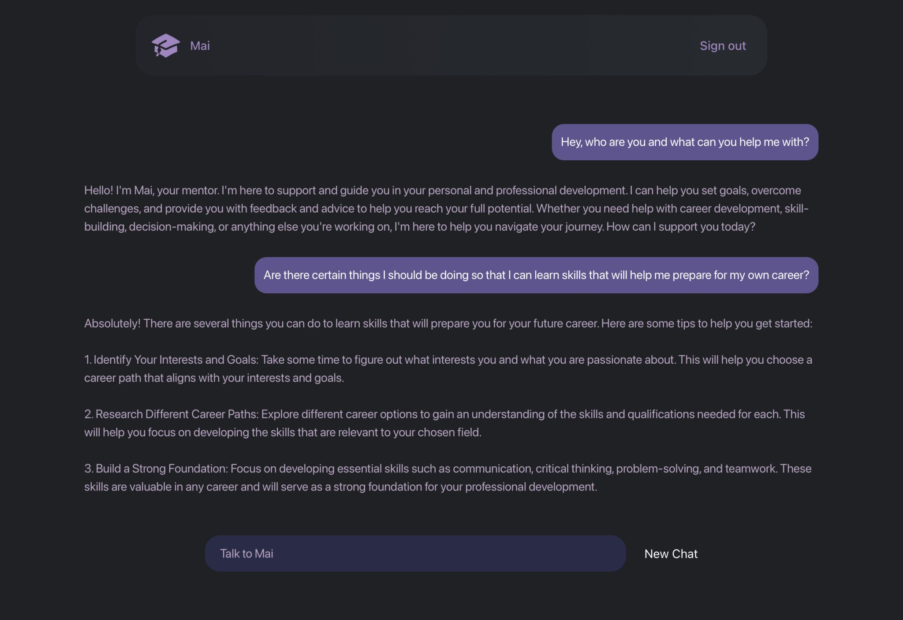
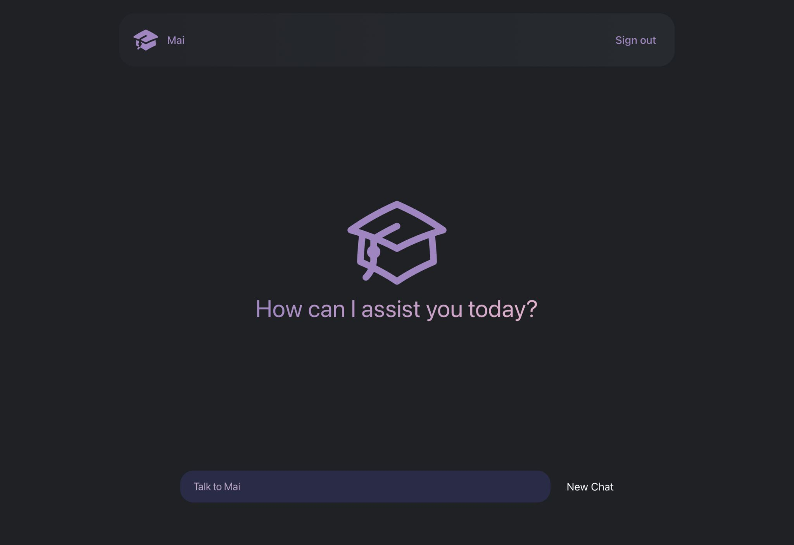
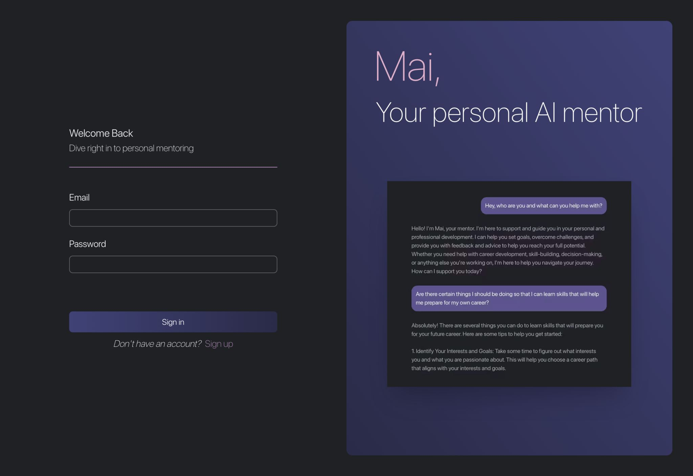
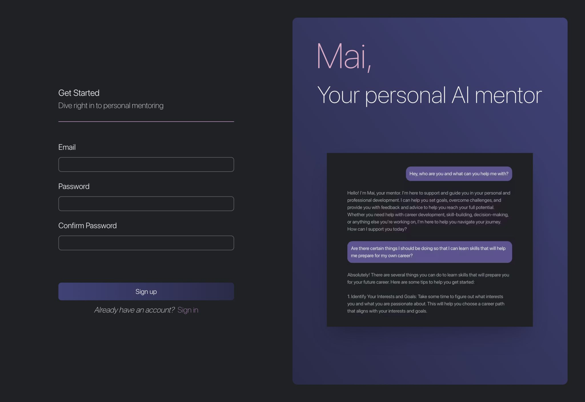

# Mai - Your Virtual Personal Mentor 🤖
Mai is an AI-powered virtual mentor that helps you ask questions and get personalized guidance

## Setup Instructions
```git clone https://github.com/alifayed02/Mai```
### Frontend

```cd Mai/Frontend```

```yarn install```
 
 ```yarn start```

 ### Backend

```cd Mai/Backend```

```pip install -r requirements.txt```

## Running Instructions
### Frontend
```cd Mai/Frontend```

```yarn start```

### Backend
```cd Mai/Backend```

```python main.py```

## Images




